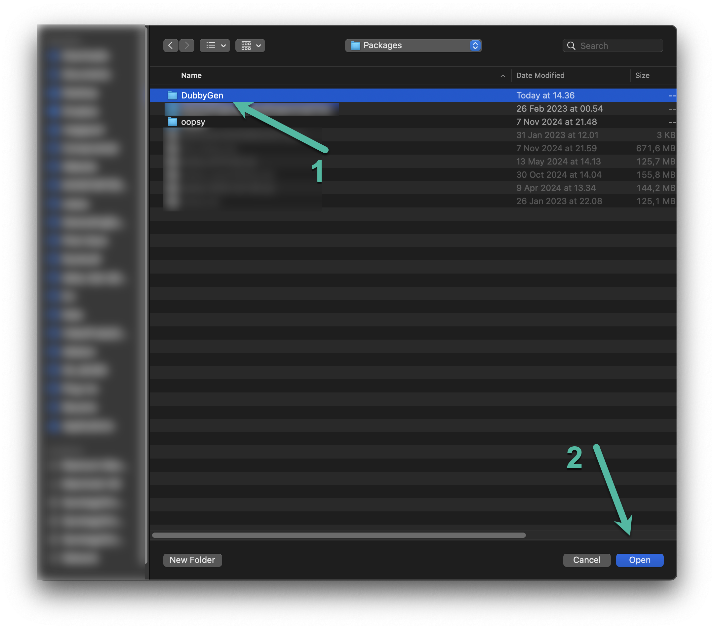

# DubbyGen
[](https://creativecommons.org/licenses/by-nc/4.0/)


---
Welcome to **DubbyGen**, the official repository for developing `gen~` patches on the **Dubby** platform by [Componental](https://componental.co). This package enables Max/MSP `Gen` users to build, test, and deploy custom DSP patches for Dubby, creating a robust, modular tool for music production and live performance.

DubbyGen is an open-platform toolkit designed for developers, musicians, and sound designers to create and share custom audio effects and musical applications on the Dubby device made with [Gen](#recommended-reading).


## Overview
DubbyGen is designed to integrate seamlessly with **Oopsy**, Componental's fork from [ElectroSmith](https://github.com/electro-smith/oopsy) adapted for Dubby. With DubbyGen, developers can:<br>
#### Access a library of `gen~` modules for DSP effects and synthesis - coming soon.
#### Use example patches to explore Dubby’s audio processing capabilities - coming soon.
#### Deploy patches to Dubby via the Oopsy package for embedded performance - coming soon.


## Features
- **Patch Templates and DSP Components**: Reusable DSP modules and templates tailored for Dubby’s hardware capabilities.
- **Example Patches**: A collection of patches to kickstart your Dubby development, available in the Max "Examples" folder once installed.
- **Documentation and Resources**: In-depth resources and examples on developing, deploying, and optimising patches for Dubby.

## Requirements
- **Max/MSP with `Gen~`**: Required for building and editing patches. `Gen` is a package included in Max. [Get Max here](https://cycling74.com/products/max)
- **Oopsy for Dubby - WILL BE AVAILABLE LATER**: Our customised fork of [Electro-smith's Oopsy](https://github.com/electro-smith/oopsy) to flash `Gen` patches to Dubby. **~~Get Oopsy for Dubby here~~**. <!-- [Get Oopsy for Dubby here - WILL BE AVAILABLE LATER](https://github.com/Componental/oopsy) -->


## Installation STEP 1 of 2
### Installing DubbyGen on *macOS*
To install DubbyGen as a Max Package on macOS:

1. **Clone the Repository - CHECK YOUR VERSION OF MAX!**<br>
   Clone this repository into your Max Packages directory:
   ```bash
   cd ~/Documents/Max 8/Packages/
   git clone https://github.com/Componental/DubbyGen.git

### In case Oopsy _is not installed_

2. **~~Install Componental's fork of Oopsy - CHECK YOUR VERSION OF MAX!~~ - WILL BE AVAILABLE LATER**<br>
   DubbyGen depends on Oopsy to flash Gen patches to Dubby. Clone our Oopsy fork:
   ```bash
   cd ~/Documents/Max 8/Packages/
   git clone ...................
<!--git clone https://github.com/Componental/oopsy.git -->

3. **Restart Max** <br>
   Once installed, restart Max to load the new DubbyGen package and access the example patches.

___

### Installing DubbyGen on *Windows*
To install DubbyGen as a Max Package on Windows:

1. **Clone the Repository - CHECK YOUR VERSION OF MAX!** <br>
   Clone this repository into your Max Packages directory:
   ```bash
   cd "%UserProfile%\Documents\Max 8\Packages"
   git clone https://github.com/Componental/DubbyGen.git

### In case Oopsy _is not installed_

2. **~~Install Componental's fork of Oopsy - CHECK YOUR VERSION OF MAX!~~ - WILL BE AVAILABLE LATER** <br>
   DubbyGen depends on Oopsy to flash Gen patches to Dubby. Clone our Oopsy fork:
   ```bash
   cd "%UserProfile%\Documents\Max 8\Packages"
   git clone ...................
<!--git clone https://github.com/Componental/oopsy.git -->


3. **Restart Max** <br>
   Once installed, restart Max to load the new DubbyGen package and access the example patches.

___

## Installation STEP 2 of 2
**Adding DubbyGen to the Max file search path.** <br>
1.  Add Path to Max<br>
2.  Open Max, go to **Options** > **File Preferences**, and add the path to your DubbyGen package.<br>


<!-- 
<br style="clear: left;"> -->
Select Directory
In the file browser, navigate to the DubbyGen package directory, select it, and confirm.
<!-- 
<br style="clear: left;"> -->


Confirm Directory Added to Max
The DubbyGen directory should now appear in Max’s file preferences, indicating successful addition.
<!-- 
<br style="clear: left;"> -->


## Getting Started
1. **~~Explore Examples~~ - coming soon** <br>
   Open Max, go to Help > Examples, and ~~select "Dubby Examples" for a hands-on introduction to Dubby patch development~~.

2. **Create Custom Patches** <br>
   Use DubbyGen’s templates and DSP modules to design your patches. Open a new patch, add a `Gen~` object, and use the provided modules.

3. **Deploy with Oopsy** <br>
With your patch open, follow the Oopsy instructions to flash it directly to your Dubby hardware.

### For visual help, we recommend <a href="https://docs.google.com/drawings/d/1p4nco4eNFxnIVxxpjSV43LngKJWghzVtAyDIksOQljs/edit?usp=sharing" target="_blank"><b>duplicating this Google Drawing template</b></a> and using it as an overview for **parameter mapping** and **DSP Block Diagram**.

<a href="https://docs.google.com/drawings/d/1p4nco4eNFxnIVxxpjSV43LngKJWghzVtAyDIksOQljs/edit?usp=sharing" target="_blank">
	
</a>
<!--  -->

## Recommended reading
### Graham Wakefield: Generating Sound & Organizing Time: Thinking With `gen~` Book 1 [BOOK]
<a href="https://cycling74.com/books/go" target="_blank">
  
  <br>See more here</a> <br>
<a href="https://github.com/grrrwaaa">Link to Graham Wakefield's Github profile.</a>

### `Gen` for beginners [ONLINE TUTORIAL]
<!--- <a href="https://cycling74.com/tutorials/gen~-for-beginners-part-1-a-place-to-start"></a> -->

**Explore the basics of using `gen~` with this beginner-friendly video series from Cycling74.**

- [Gen~ for Beginners, Part 1: A Place to Start](https://cycling74.com/tutorials/gen~-for-beginners-part-1-a-place-to-start)
- [Gen~ for Beginners, Part 2: Similarities and Differences](https://cycling74.com/tutorials/gen~-for-beginners-part-2-similarities-and-differences-1)
- [Gen~ for Beginners, Part 3: Counting, and a World without bang Messages](https://cycling74.com/tutorials/gen~-for-beginners-part-3-counting-and-a-world-without-bang-messages)
- [Gen~ for Beginners, Part 4: Working with Buffers (and Data)](https://cycling74.com/tutorials/gen~-for-beginners-part-4-working-with-buffers-%C2%ABand-data%C2%BB)
- [Gen~ for Beginners, Part 5: The Codebox Operator](https://cycling74.com/tutorials/gen~-for-beginners-part-5-the-codebox-operator)
- [Gen~ for Beginners, Part 6: Thinking Inside the Codebox](https://cycling74.com/tutorials/gen~-for-beginners-part-6-thinking-inside-the-codebox)
- [Gen~ for Beginners, Part 7: Creating Reusable Tools](https://cycling74.com/tutorials/gen~-for-beginners-part-7-creating-reusable-tools)


## Contribution
[Read more about contributing here](https://github.com/Componental/DubbyGen/blob/main/CONTRIBUTING.md). <br>
Please review [this issue](https://github.com/Componental/DubbyGen/issues/2) for a discussion about the timing and considerations for making this repository public.


## Support
Get in touch with us via:

- <a href="https://bit.ly/m/componental" target="_blank">
  Link-in-Bio</a> <br>

- <a href="https://discord.com/invite/swUnCvDbvf" target="_blank">
  Discord</a>    
- <a href="https://www.instagram.com/componental.co/" target="_blank">
  Instagram</a>    
- <a href="https://www.linkedin.com/company/componental" target="_blank">
  LinkedIn</a>   
- <a href="https://youtube.com/@Componental" target="_blank">
  YouTube</a>


## License
DubbyGen is licensed under a **Creative Commons Attribution-NonCommercial 4.0 International License (CC-BY-NC 4.0)** with additional terms for code generated via Cycling74’s Max/gen environment. For full license terms, including these modifications and Cycling74 Gen Code Export Licensing information, please see the [LICENSE file](./LICENSE.md).